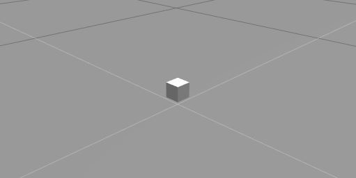
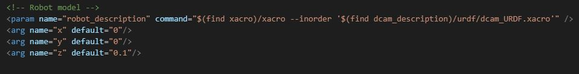
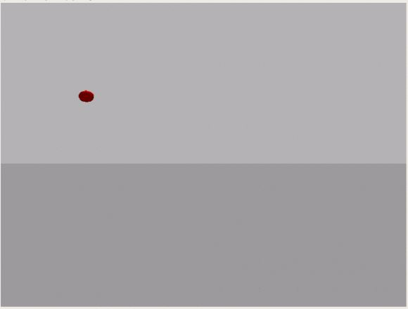

# dcam_description
dcam_description uses Ros Kinetic and Gazebo

dcam_description contains a depth and RGB camera which uses its color and depth image to locate a sphere in 3D space. n

## Dependencies
Openni: https://github.com/OpenNI/OpenNI
CV_Bridge: https://github.com/ros-perception/vision_opencv

## Specifications

FOV: 1.047198 radians, or approximately 60 degrees
Resolution: 600x600
RGB sight distance: 0.05 to 3 m
Depth sight distance: 0.2 to 3 m
RGB refresh rate: 20 Hz
Depth refresh rate: 1 Hz

These specifications were set with the limited processing resources in the free version of Ros Development Studio in mind.

## Launching

To spawn the camera, use this command:

    roslaunch dcam_description spawn.launch

This will spawn the depth camera at the position specified in the launch file. The camera should spawn in like this:

To change the spawn location, modify the values of these arguments in the launch file, keeping in mind that the camera by default points along the x-axis:

## Image Processing
### Processing Map
The image processing follows the map below:

Please see the appendix for a full list of active topics and nodes. The camera publishes the color image to the topic ending in /color/image_raw, which is subscribed to by the image_converter node. This node is responsible for using OpenCV and CV_Bridge to recognize circles using a Hough transform within a specified pixel diameter range and locate the center with pixel coordinates. The coordinate information is published tothe /yz_pix topic. Meanwhile, the depth image is published to the topic ending in /depth/image_raw, which contains a depth distance in meters for each pixel. the depth_finder node subscribes to this and the /yz_pix topic and finds the location in 3D space relative to the camera, with the relative x-direction as depth, y as left and z as up. These values are published to the /button_xyz topic. 

### Modifying Detection Parameters
It is not advised that any detection parameters are changed. For explanation about what each parameter means, please see this handy tutorial on OpenCV's own website: https://docs.opencv.org/2.4/doc/tutorials/imgproc/imgtrans/hough_circle/hough_circle.html

## Troubleshooting

If there is a string of errors appearing in the command console which do not relate to a missing dependency, it is most likely because the camera is not recognizing any circles. Use the following command to see a first-person view from the camera and ensure that there is a circle within the field of view.

    rosrun image_view image_view image:=/depth_camera_ir/depth_camera/depth/image_raw

This outputs this video feed, hopefully with a circle somehwere in sight:

## Appendix

### Topics

/button_xyz
/clock
/depth_camera_ir/depth/camera_info
/depth_camera_ir/depth_camera/color/camera_info
/depth_camera_ir/depth_camera/color/image_raw
/depth_camera_ir/depth_camera/color/image_raw/compressed
/depth_camera_ir/depth_camera/color/image_raw/compressed/parameter_descriptions
/depth_camera_ir/depth_camera/color/image_raw/compressed/parameter_updates
/depth_camera_ir/depth_camera/color/image_raw/compressedDepth
/depth_camera_ir/depth_camera/color/image_raw/compressedDepth/parameter_descriptions
/depth_camera_ir/depth_camera/color/image_raw/compressedDepth/parameter_updates
/depth_camera_ir/depth_camera/color/image_raw/theora
/depth_camera_ir/depth_camera/color/image_raw/theora/parameter_descriptions
/depth_camera_ir/depth_camera/color/image_raw/theora/parameter_updates
/depth_camera_ir/depth_camera/depth/image_raw
/depth_camera_ir/depth_camera/depth/points
/depth_camera_ir/parameter_descriptions
/depth_camera_ir/parameter_updates
/gazebo/link_states
/gazebo/model_states
/gazebo/parameter_descriptions
/gazebo/parameter_updates
/gazebo/set_link_state
/gazebo/set_model_state
/rosout
/rosout_agg
/yz_pix

### Nodes

/depth_finder
/image_converter
